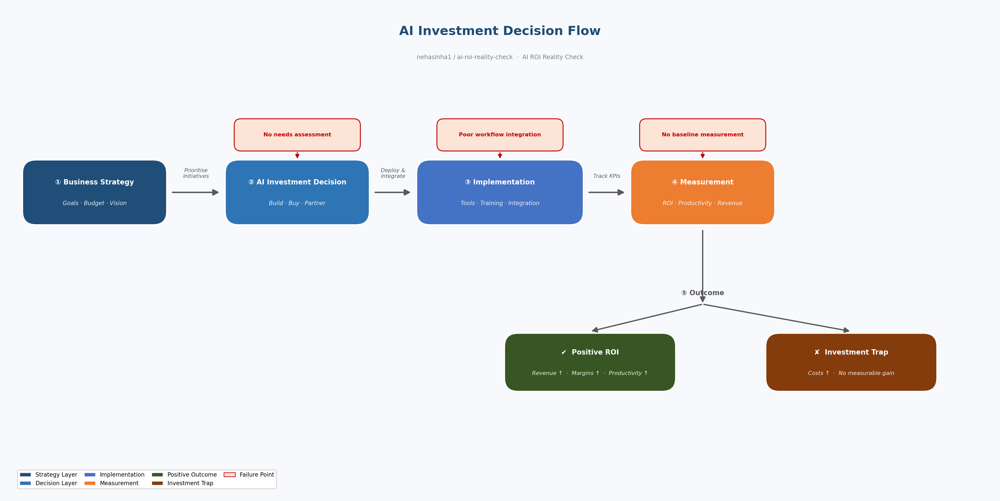

# AI ROI Reality Check

**Tools:** Excel/Spreadsheets · MS Visio · SharePoint · ServiceNow

> **TL;DR:** Higher AI investment does not guarantee better business outcomes. Analysis of 17 companies across 6 industries from 2024–2026 shows inconsistent ROI - with some of the highest AI spenders reporting negative revenue growth. This project examines where AI investment pays off and where it becomes a financial trap.

## Key Questions

- Is there a statistically meaningful correlation between AI investment and revenue growth?
- Do AI-heavy companies show better operating margins - or are costs outpacing returns?
- Which industries show the strongest ROI signal from AI investment?
- What non-financial outcomes (talent retention, employee productivity) correlate with AI spend?

## Data Sources

| Dataset | Source | Last Updated |
|---|---|---|
| [`ai_investment_business_outcomes_2024_2026.csv`](https://github.com/nehasinha1/ai-hidden-cost-power-grid/blob/main/data/ai_investment_business_outcomes_2024_2026.csv) | [S&P 500 filings](https://www.macrotrends.net/stocks/research) · [Stanford HAI AI Index 2026](https://hai.stanford.edu/ai-index/2026-ai-index-report) · [McKinsey State of AI 2025](https://www.mckinsey.com/capabilities/quantumblack/our-insights/the-state-of-ai) | June 2026 |

## Methodology

```
S&P 500 public financial filings + Stanford HAI AI Index + McKinsey State of AI
    │
    ▼
Excel (data cleaning, investment scoring, outcome indexing, pivot analysis)
    │
    ▼
MS Visio (framework diagram: AI investment to business outcome pathways)
    │
    ▼
SharePoint (documentation and stakeholder reporting hub)
    │
    ▼
ServiceNow (CMDB-style documentation template for tracking AI initiative ROI)
```

## Process Flow & Documentation

📋 **AI Investment Decision Flow (MS Visio)**




## Files

| File | Description |
|---|---|
| [`data/ai_investment_business_outcomes_2024_2026.csv`](data/ai_investment_business_outcomes_2024_2026.csv) | AI investment and business outcome data for 17 companies across 6 industries, 2024–2026 |
| [`excel/ai_roi_analysis.xlsx`](excel/ai_roi_analysis.xlsx) | Excel workbook: raw data, summary analysis, investment vs ROI, industry comparison |
| [`diagrams/ai_investment_decision_flow.png`](diagrams/ai_investment_decision_flow.png) | MS Visio-style process flow diagram |
| [`sharepoint-docs/project_documentation.docx`](sharepoint-docs/project_documentation.docx) | SharePoint-style project wiki |
| [`servicenow/servicenow_change_request.pdf`](servicenow/servicenow_change_request.pdf) | ServiceNow change request ticket |

## Key Findings (2024–2026 Data)

- **Higher spend ≠ higher returns:** IBM ($3.5B AI spend) posted just 1.6% revenue growth and 4.8% ROI in 2024 Q4
- **Negative ROI is common:** Citi (-3.8%), Ford (-6.8%), and Target (-4.2%) all reported negative AI ROI in 2024 Q1 despite significant investment
- **Outliers exist:** Microsoft consistently delivers 31-39% AI ROI - but its scale and integration depth are exceptional, not typical
- **Consulting leads on ROI efficiency:** McKinsey generates 18-20% ROI on relatively modest AI spend (~$420-480M), outperforming firms spending 10x more
- **Healthcare is improving:** Pfizer reversed negative revenue growth (-4.8% in 2024 Q1) to positive territory (+4.8%) by 2025 Q2 as AI initiatives matured
